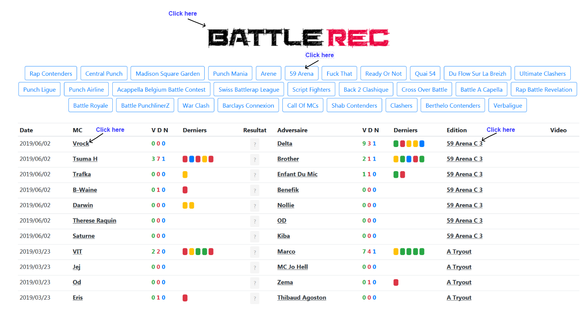
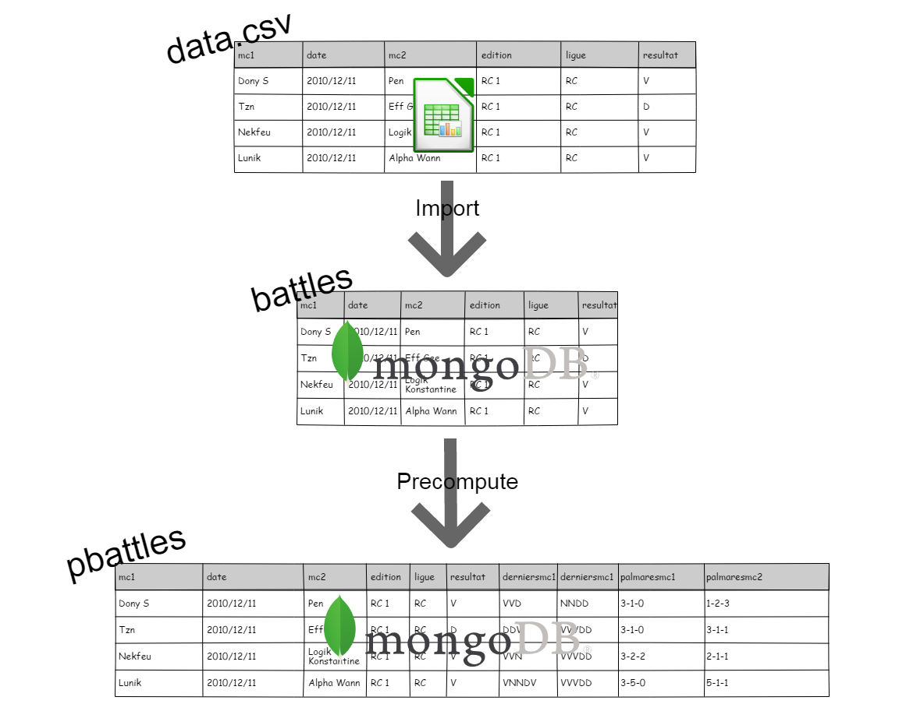
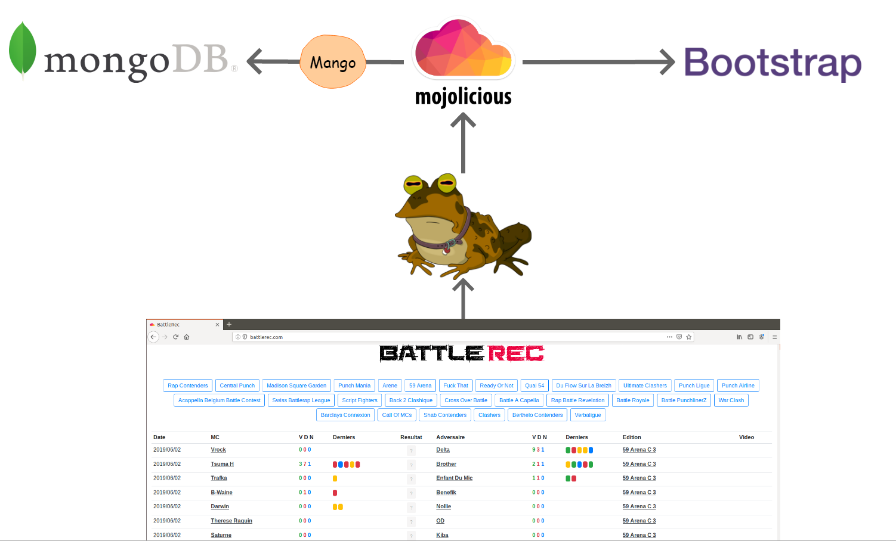

# battlerec

## Summary 

This is the code running [battlerec.com](http://battlerec.com/)

[battlerec.com](http://battlerec.com/) is a light [boxrec](https://boxrec.com/) clone for french battlerap scene.

Bigup to all Battle MCs, this is thanks to you :kissing_heart: and event organizers that we can enjoy epic battles and have a lot of fun.

## Website navigation 

There are numerous labels on the website that you can click to navigate :

- Go to a page dedicated to a **MC** (click on MC name) 
- Go to a page dedicated to a **League** (click on league in event page) 
- Go to a page dedicated to a **Event** (click on event name in main page or league page) 
- Or go back to **Main page** (click on logo)

## Technical stack 

It is written in Perl :heart: and the web framework [Mojolicious](https://mojolicious.org/).

The data are initially in a csv file [data.csv](https://github.com/thibaultduponchelle/battlerec/blob/master/data.csv)

Then imported in [MongoDB](https://www.mongodb.com/) using `mongoimport`.

Then the data is retrieved thanks to the driver [Mango](https://metacpan.org/pod/Mango).

And served by [hypnotoad](https://mojolicious.org/perldoc/Mojo/Server/Hypnotoad) (from [Mojolicious](https://mojolicious.org/)).

With some [bootstrap](https://getbootstrap.com/) for styling tables/badges/buttons.

### Data flow 

### Serving the website 

### Development

- **setup.sh** : To setup the dev environment 
- **data.csv** : contains list of battles 
- **initdb.sh** : remove data from mongodb then import new data from data.csv file. Very first load of the website will be slow as it has to precompute the data (`battles` -> `pbattles`) 

Use `morbo script/battle_rec` to start serving your [localhost instance](http://localhost:3000)

### Production

- **lib_systemd_system_battlerec.service** : this file goes in **/lib/systemd/system/battlerec.service**

Use `service battlerec start` to serve your application
