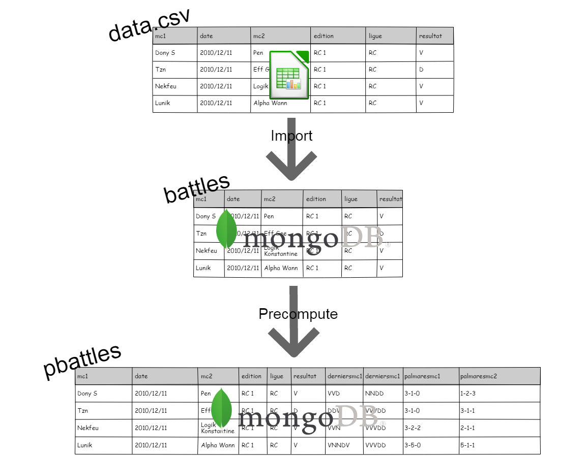
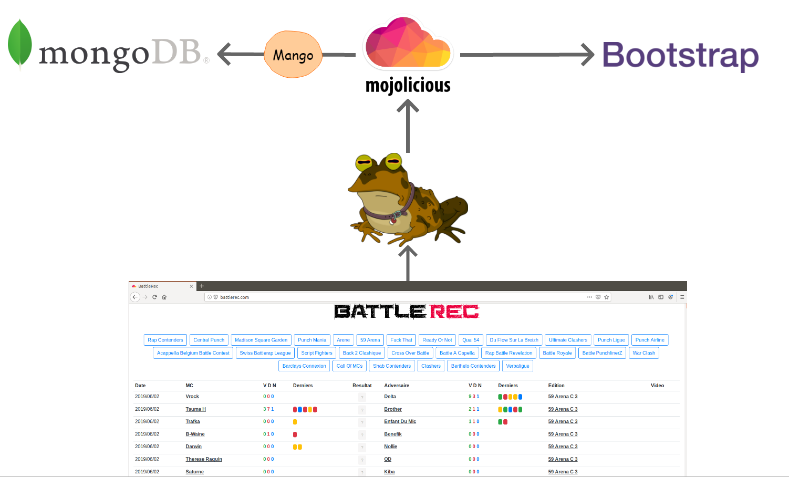

# battlerec

## Summary 

This is the code running [battlerec.com](http://battlerec.com/).

[battlerec.com](http://battlerec.com/) is a light [boxrec](https://boxrec.com/) clone for french battlerap scene.

Bigup to all Battle MCs, this is thanks to you :kissing_heart: and event organizers that we can enjoy epic battles and have a lot of fun.  

## Technical stack 

It is written in Perl :heart: and the web framework [Mojolicious](https://mojolicious.org/).

The data are initially written in a csv file [data.csv](https://github.com/thibaultduponchelle/battlerec/blob/master/data.csv)

Then imported in [MongoDB](https://www.mongodb.com/) using the driver [Mango](https://metacpan.org/pod/Mango).

And finally exposed by [hypnotoad](https://mojolicious.org/perldoc/Mojo/Server/Hypnotoad) (from [Mojolicious](https://mojolicious.org/)).

It also uses [bootstrap](https://getbootstrap.com/) for styling tables and badges/buttons.

### Data flow 

### Serving the website 

